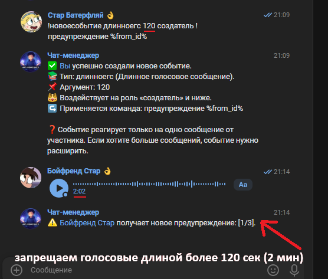
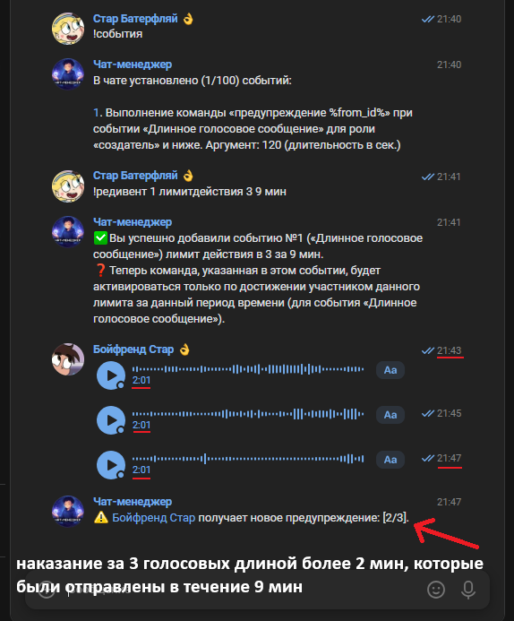

# VK Chat Manager Bot

Многофункциональный бот для управления и модерации многопользовательских бесед ВКонтакте.

Проект вдохновлён возможностями известного крупного VK-бота [Чат-менеджера](https://vk.com/cm) и реализует большинство его функций, а также имеет собственные уникальные функции.

> Более **70 команд** • **16 функциональных подсистем** • **Unit** и **Integration** тесты

---

## 📷 Демонстрация

> GIF работы бота

---

## 📑 Содержание

- [Ключевые подсистемы](#-ключевые-подсистемы)
    - [События](#️-события)
    - [Субменеджеры](#-субменеджеры)
    - [Админ-чаты](#-админ-чаты)
    - [Массовая очистка сообщений](#-массовая-очистка-сообщений)
    - [Роли](#-роли)
    - [Система разрешений](#-система-разрешений)
    - [Таймеры](#-таймеры)
    - [Массовое исключение участников](#-массовое-исключение-участников)
    - [Модерация](#-модерация)
    - [Статистика](#-статистика)
    - [Логчаты](#-логчаты)
    - [Иммунитеты](#-иммунитеты)
    - [Настройки беседы](#-настройки-беседы)
    - [Управление через ЛС](#-управление-через-личные-сообщения)
    - [Все команды](#-все-команды)
- [Технологический стек](#-технологический-стек)
- [Архитектура](#-архитектура)
- [Тестирование](#-тестирование)
- [Запуск проекта](#-запуск-проекта)

---

# ✨ Ключевые подсистемы

## ⚙️ События

Система событий позволяет автоматически выполнять **любую существующую команду** при совершении участниками определенных действий в чате.
### Пример

Участник чата отправляет определенное слово (например,`чебурек`) → бот автоматически выполняет команду `исключить` в отношении этого участника (и удаляет его сообщение, если это настроено).
В данном примере `отправка определенных слов` это **тип события**. Всего в боте доступно **53 различных типа событий для создания**;

### Примеры типов событий

- приглашение человека в чат;
- изменение названия чата;
- приглашение забаненного участника;
- **наличие или отсутствие у участника подписки на определенное сообщество**;
- запрещённые слова в сообщении;
- **идентичные сообщения, отправленные подряд**;
- количество пересланных сообщений;
- отправка любого стикера;
- отправка любой ссылки
- отправка текста, который соответствует **указанному вами регулярному выражению**
- отправка любого голосового сообщения;
- **отправка длинного/короткого** голосового сообщения;
- отправка большого количества эмодзи;
- создание видео/аудио звонка в чате;
- и ещё более **35** различных событий (команда «**!события доступные**» для просмотра всего списка).

Конечно, аргументы ко всем типам событий **гибко настраиваются** (какие голосовые считать длинными/короткими  и т.д.)

### Возможности
- выполнение практически любых из **70+ команд**;
- реагирование только на участников с **нужной вам ролью** (например, **на модераторов и ниже**)
- реагирование **персонально только на одного нужного участника**
- реагирование на всех участников, **кроме тех которых вы занесете в список исключений**
- кулдауны (например, реагирование на участника **максимум 1 раз в 10 минут**)
- работа события только в **определённое время суток** (например, **ежедневно с 00:00 до 08:00**);
- реагирование только на **новых участников** (вы **сами указываете период**, в течение которого участника нужно **считать новым**)
- редактирование **роли/команды** события после создания события

Практически любое событие можно сделать **расширенным**.
Например, событие `отправка стикера` по-умолчанию реагирует только на **один стикер в сообщении**.
Однако можно сделать так, чтобы оно реагировало только если участник отправит, например, **10 и более стикеров в течение 5 минут**.
Все эти аргументы также **гибко настраиваются**.

  
  

---

## 🔄 Субменеджеры

...

---

## 👥 Админ-чаты

...

---

## 🧹 Массовая очистка сообщений

...

---

## 👑 Роли

...

---

## 🔐 Система разрешений

...

---

## ⏱ Таймеры

...

---

## 🚪 Массовое исключение участников

...

---

## 🛡 Модерация

...

---

## 📊 Статистика

...

---

## 📝 Логчаты

...

---

## 🛡 Иммунитеты

...

---

## 🛠 Настройки беседы

...

---

## 💬 Управление через личные сообщения

...

---

## ➕ Все команды

> Здесь будет таблица или список всех команд.

---

# 🛠 Технологический стек

### Backend

- Java 21
- Spring Boot
- Spring Data JPA
- Hibernate

### Базы данных и инфраструктура

- PostgreSQL
- Redis
- Docker
- Docker Compose

### Тестирование

-

JUnit 5
- Mockito
- Spring Boot Test

---

# 🏗 Архитектура

> Диаграмма приложения

---

# 🧪 Тестирование

Проект покрыт:

- unit-тестами сервисов;
- unit-тестами команд;
- unit-тестами утилит;
- интеграционными тестами репозиториев.

---

# 🚀 Запуск проекта

Инструкция по запуску.